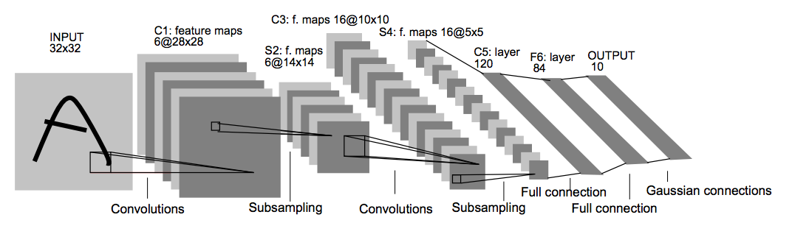

# Traffic Sign Recognition Classifier

### Overview
---
In this project, a traffic sign recognition classifier is build and trained using images from the [German Traffic Sign Dataset](http://benchmark.ini.rub.de/?section=gtsrb&subsection=dataset). The trained model can then be used to predict traffic signs taken from the internet. In this readme the [implementaion](https://github.com/heliotropium72/traffic_sign_classifier/blob/master/Traffic_Sign_Classifier.ipynb) is described in detail and all questions from the [project rubric](https://review.udacity.com/#!/rubrics/481/view) are answered.

[//]: # (Image References)

[imgDataset]: ./report_images/exampledata.png "Example"
[imgAugmented]: ./report_images/augmented.png "Augemented image"
[imgPreprocessed]: ./report_images/preprocessed.png "Preprocessed image"
[imgTest]: ./report_images/testimages.png "Test image"

[label_dist1]: ./report_images/labels1.png "Distribution of labels"
[label_dist2]: ./report_images/labels2.png "Distribution of labels after augmentation"

### Dependencies
This notebook requires:
- Python 3.3 or above
- Tensorflow 1.3.0 or above
- OpenCV
- Pandas

The easiest way to get started is using the [CarND Term1 Starter Kit](https://github.com/udacity/CarND-Term1-Starter-Kit) and upgrading/ installing the above packages. The lab environment can be created with CarND Term1 Starter Kit. Click [here](https://github.com/udacity/CarND-Term1-Starter-Kit/blob/master/README.md) for the details.

The notebook should be run using GPUs. If local GPUs are not available consider using a web service e.g. AWS. On AWS, there is a Community AMI "Udacity self-driving car" which can be used after upgrading to a newer version of tensorflow.

## Description of the German Traffic Sign Dataset

### 1. Basic summary of the data set

I used the pandas library to calculate summary statistics of the traffic signs data set:

* The size of training set is 34799
* The size of the validation set is 4410
* The size of test set is 12630
* The shape of a traffic sign image is 32x32x3
* The number of unique classes/labels in the data set is 43

In the following 15 random images of the dataset are displayed.
![alt text][imgDataset]

### 2. Exploratory visualization of the dataset.

![alt text][label_dist1]

The labels are not equality distributed over the dataset. The data set consists to 5.8% of the traffic sign "speed limit (50km/h)" but only to 0.5% of the traffic sign "speed limit (20km/h)". All over traffic signs are contained in the between interval.
Here is an exploratory visualization of the data set. It is a bar chart showing how the data is distributed over the labels. The traffic sign "speed limit (50km/h)" is the most common sign while the traffic sign "speed limit (20km/h)" is the least common one. Hence, the model might get biased towards frequent labels. This could be checked for example with the recall and precision metrics (but is not done here). Adding more images with less frequent labels can circumvent this potential biases and has a side effect that the model is less likely to overfit to the data due to the larger dataset.

## Design and Test a Model Architecture

### 1. Data augmentation
The dataset was augmentated by randomly modified copies of the original images. The `tensorflow.image` module offers already several functions for data augmentation:
- random saturation
- random contrast
- random brightness
- random crop (not applicable, without resizing separately)

I used a combination of all functions to augement the data set. In the following is the result for a test image.
![alt text][imgAugemented]

Every label was augemented by at least 10 images until the label contained at least 500 images.
After augementaion, the training data contained ... images. The labels are distributed more equally now.
![alt text][label_dist2]

### 1. Image preprocessing

The image were converted to grayscale and then normalized using
`data - np.array(data).mean()) / np.array(data).std()`

Here is an example of a traffic sign image before and after preprocessing.

![alt text][imgPreprocessed]

I used grayscaling to reduce the dimensionality of the data. However I considered adding the red and blue channels after thresholding since the traffic signs consist mainly of the colours black, white, red and blue.
The normalization is necessary so that the weights can be similar for every image and that the model does not get biased towards particularly "bright" images.

### 2. Model architecture 

Source: Yan LeCun

The LeNet Convolutional network was adapted to the traffic sign recognition problem by changing the output classes to 43 and adding dropout layers in the fully connected layers in order to prevent overfitting. The resulting model architecture is the following:

| Layer         		 |     Description	         | Input | Output | Parameters |
|:----------------------:|:-------------------------:|:-------: | :--------:|:----------:|
| Convolution 5x5        | 1x1 stride, valid padding | 32x32x1  | 28x28x6   | 582  |
| Activation			 | ReLU					     |          |           |      |
| Max pooling	      	 | 2x2 stride				 | 28x28x6  | 14x14x6   |      |
| Convolution 5x5        | 1x1 stride, valid padding | 14x14x6  | 10x10x12  |      |
| Activation			 | ReLU					     |          |           |      |
| Max pooling	      	 | 2x2 stride				 | 10x10x12 | 5x5x12    |      |
| Flatten                | from 3D to 1D             | 5x5x12   | 400       |      |
| Fully connected		 |          				 | 400      | 200       |      |
| Activation			 | ReLU					     |          |           |      |
| Dropout                | Probability: 75%          |          |           |      |          
| Fully connected		 |          				 | 200      | 84        |      |
| Activation			 | ReLU					     |          |           |      |
| Dropout                | Probability: 75%          |          |           |      |
| Fully connected(Logits)|							 | 84       | 43        |      |
| Softmax                |                           |          |           |      |
|:----------------------:|:-------------------------:|:-------: | :--------:|:----------:|
| Total                  |                           |          |           |  ???    |

I decided to use the basic LeNet model because my own modifications (inception layers, deeper networks,...) did not improve the accuracy significantly. Hence, I prefered using a simple model and rather finish the project than searching for the perfect solution. The LeNet architecture is already suited to the image dimensions and thus needs only few adaptions. Since more output classes (43 instead of 10) are present, a deeper or more complex convolutional network (e.g. based on AlexNet) would be better suited.

### 3. Model training
The model was trained with gradient descent. After every epoch the loass of the cross entropy is calculated and then minimized using the Adam optimizer.
The following hyperparameters were used for training as they showed the best trade-off between overfitting (dropout,...), oscillating accuracy (large learning rate, small batch number,...) and training time (number of epochs,...). 

| Hyperparameter | Value  | 
|:--------------:|:------:|
| Learning rate  | 0.0008 |
| Dropout	     | 0.75   | 
| Batch size     | 512    |
| Epochs         | 30     |

### 4. Model validation
e.g. training accuracy >> validation accuracy)

After finding the right steps for image augmentation and preprocessing, only the hyperparameters were tuned. I tried several combinations and checked the behavior of the model for
- overfitting e.g. if training accuracy >> validation accuracy >> test accuracy -> increase dropout
- oscillation of the accuracy -> decrease learning rate, increase batch size
- saturation of the accuracy -> increase learning rate, increase number of epochs
- training time -> decrease number of epochs, decrease batch size (more parallelisation)

My final model results were:
|Data set  | Accuracy |
|:--------:|:--------:|
|Training  | ? |
|Validation| ? |
|Test      | ?|

## Test the Model on New Images

### 1. German traffic signs from the internet
The test images are a mixture of photos and pictograms at different cropings and perspectives. Also modified versions of the original traffic signs are present. I selected the following 15 traffic signs:

![alt text][imgTest]

Short overview table of the traffic signes

|Image| Difficulty|
|:--:|:--:|
|Speed Limit (20km/h) |pictogram|
|Speed Limit (20km/h) ||
|Speed Limit (30km/h) |zone sign|
|Speed Limit (50km/h) |pictogram|
|Speed Limit (50km/h) ||
|No passing | |
|No entry | Funny modification / obscured |
|General caution| not centered|
|Dangerous curve to the left| small |
|Dangerous curve to the left||
|Slippery road | |
|Road Work | pictogram |
|Pedestrians| painted on street|
|Pedestrians||
|Keep right | |

There are images which belong to the most common classes ("Speed limit (50km/h)") with 5.8% presence in the original training data and image of classes with few data ("Speed limit (20km/h)", "Dangerous curve to the left", "Pedestrians").

### 2. Predictions of test images
Discuss the model's predictions on these new traffic signs and compare the results to predicting on the test set. At a minimum, discuss what the predictions were, the accuracy on these new predictions, and compare the accuracy to the accuracy on the test set (OPTIONAL: Discuss the results in more detail as described in the "Stand Out Suggestions" part of the rubric).

Here are the results of the prediction:

| Image			        |     Prediction	        					| Probability|
|:---------------------:|:---------------------------------------------:| :---:|
|Speed Limit (20km/h) |pictogram||
|Speed Limit (20km/h) |||
|Speed Limit (30km/h) |zone sign||
|Speed Limit (50km/h) |pictogram||
|Speed Limit (50km/h) |||
|No passing | ||
|No entry | Funny modification / obscured ||
|General caution| not centered||
|Dangerous curve to the left| small ||
|Dangerous curve to the left|||
|Slippery road | ||
|Road Work | pictogram ||
|Pedestrians| painted on street||
|Pedestrians|||
|Keep right | ||

The model was able to correctly guess x of the 15 traffic signs, which gives an accuracy of xx. This compares favorably to the accuracy on the test set of ...

### 3. Top 5 softmax probabilities of predictions
Describe how certain the model is when predicting on each of the five new images by looking at the softmax probabilities for each prediction. Provide the top 5 softmax probabilities for each image along with the sign type of each probability. (OPTIONAL: as described in the "Stand Out Suggestions" part of the rubric, visualizations can also be provided such as bar charts)

The code for making predictions on my final model is located in the 11th cell of the Ipython notebook.

For the first image, the model is relatively sure that this is a stop sign (probability of 0.6), and the image does contain a stop sign. The top five soft max probabilities were

| Probability         	|     Prediction	        					| 
|:---------------------:|:---------------------------------------------:| 
| .60         			| Stop sign   									| 
| .20     				| U-turn 										|
| .05					| Yield											|
| .04	      			| Bumpy Road					 				|
| .01				    | Slippery Road      							|

For the second image ... 

### (Optional) Visualizing the Neural Network (See Step 4 of the Ipython notebook for more details)
was not done yet

### Appendix: Calculation of model parameters
The dimensions of every layer can be caluclated according to the following equations:

Input size = input_width x input_height, x input_depth (here: 32x32x3)

Variables:
* Input size $H_{in}$ x $W_{in}$ x $D_{in}$
* Output size $H_{out}$ x $W_{out}$ x $D_{out}$
* Filter size $H_{filter}$ x $W_{filter}$ x $N_{filter}$
* Stride $S$
* Padding $P$ ('VALID':0, 'SAME':?, 'ZERO':?)

(Width and hights are symmetric here and thus only the caluclation of the width is shown in the following.)

1. Convolution Layer
    * Dimensions:
    \begin{equation}
        W_{out} = \dfrac{W_{in} − W_{filter} + 2P}{S} + 1
    \end{equation}
    \begin{equation}
        D_{out} = N_{filter}
    \end{equation}

    * Number of Parameters in this layer (parameter sharing!):
    \begin{align}
        NP_{layer} &= NP_{filter} \cdot N_{filter} + NP_{bias} \\
                    &=  (W_{filter} \cdot H_{filter} \cdot N_{filter} + 1) \cdot D_{out}
    \end{align}

2. Pooling Layer
Pooling is as a convolution with a single filter. However, the filter is not defined by weights but by chosing the maximum/average/... . Hence, the same equation holds.

    \begin{equation}
        W_{out} = \dfrac{W_{in} − W_{filter} + 2P}{S} + 1
    \end{equation}
    \begin{equation}
        D_{out} = D_{in}
    \end{equation}

3. Fully Connected Layer

    Total parameters:
    Number of Parameters $NP$
    \begin{align}
        NP_{layer} &= NP_{filter} \cdot N_{output,neurons} + NP_{bias} \\
                    &=  (W_{filter} \cdot H_{filter} \cdot N_{filter} + 1) \cdot W_{out} \cdot H_{out} \cdot D_{out}
    \end{align}

